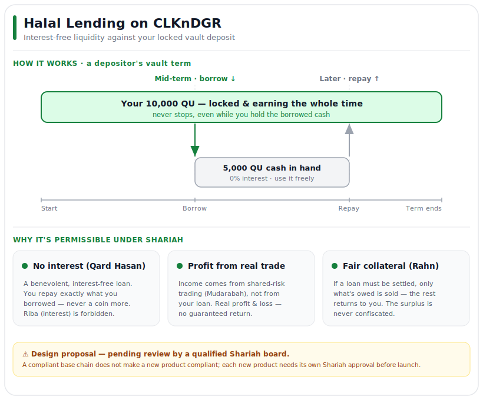

# Halal Lending on CLKnDGR
### Interest-free liquidity against your locked vault deposit — built on classical Islamic finance

> **Status: design proposal.** This document explains *how* CLKnDGR can offer Shariah-compliant lending and *why* the structure is sound. It is **not** a claim of certification. Before this feature could be offered to anyone as "Halal," it must be reviewed and approved by a qualified Shariah board. See **[Honest limits](#honest-limits-please-read)** below.

---

## In one paragraph

CLKnDGR's vault lets people lock QU as trading capital and earn a share of the profit the protocol's automated strategies generate. This proposal adds one thing: a depositor can **borrow QU against their locked deposit, interest-free**, instead of breaking the lock. The protocol charges **no interest and no loan fee** — it keeps earning the way it already does, from real, shared-risk trading. That single distinction — *income from honest trade, never from a loan* — is what makes it compatible with Islamic law.

## Why this matters

Two problems, one solution:

1. **For depositors:** capital locked for the vault term is productive but illiquid. Breaking the lock to get cash means losing your earning position and your share of profits. Borrowing against it gives you liquidity *without* leaving.
2. **For Muslim users:** nearly all crypto lending pays or charges **interest (*riba*)**, which is **forbidden (*haram*)** in Islam. That excludes a large and growing community from DeFi almost entirely. A genuinely interest-free facility lets them take part without compromising their faith.

## What it does — three actions

| Action | What happens |
|---|---|
| **1. Borrow** | Keep your deposit locked and take up to ~half its value in QU now. **No interest, ever.** |
| **2. Repay** | Pay back **exactly** what you borrowed, and your deposit is released. |
| **3. Safety-sell** *(only if needed)* | If your collateral slips too close to the loan, the protocol sells **just enough** of your position to cover it — and returns the rest to you. It never keeps the surplus. |

## A walk-through: "Yusuf"

- Yusuf deposits **10,000 QU**. It locks for the vault term and the protocol's strategies trade it — he is earning a share of the profit.
- **Mid-term:** Yusuf needs **5,000 QU** for something, but doesn't want to break the lock (that would pull his money out of the strategies and forfeit his earning position). So he **borrows 5,000 QU** against his 10,000 position — **no interest** — and his deposit **keeps earning the entire time**.
- **Later:** Yusuf repays the **5,000 QU**. His collateral is freed. He had his cash *and* never stopped earning.
- *(If his position had fallen in value and he had not repaid, the protocol would sell ~5,000 QU worth of his pledged position to settle the loan and hand him back the remaining ~5,000 — never more.)*

---

## How it merges with the CLKnDGR contract

**The vault is already a profit-sharing partnership.** Today, you deposit QU, it locks, the protocol's strategies trade it, and you earn through the growth in your share value — bearing **real gains and losses, with no guaranteed return**. In Islamic terms this is a **Mudarabah**: the depositor is the capital provider (*rab al-mal*), the protocol is the manager (*mudarib*), profit is shared by an agreed split, and the investor carries the market risk. This matters because the foundation is already aligned with Islamic finance — we are not bolting on a foreign structure.

**The lending layer adds three things on top, each mapped to a classical contract:**

- **Collateral — *Rahn* (pledge).** Your locked position is pledged as security for the loan. Crucially, the contract **already holds and custodies** your deposit for the lock term, so nothing new gets locked up — we simply mark your shares as *pledged* so they can't be withdrawn while a loan is open.
- **The loan — *Qard Hasan* (benevolent loan).** The contract sends you QU, up to a safe fraction of your position's value (a conservative loan-to-value, e.g. 50%). You repay the **same amount** to release the pledge. **No interest. No fee tied to the loan.**
- **Liquidation — the *Rahn* default rules.** If your collateral's value falls too close to the loan, the contract sells *just enough* of your pledged shares to repay the loan and **returns the remainder to you**. It never seizes ownership and never keeps a surplus.

**Engineering footprint is light.** The collateral is already locked and custodied, and every loan is **over-collateralized** (you borrow less than your deposit is worth), so the protocol's risk is low and the new code is modest — a few on-chain actions (borrow, repay, and an automatic safety-sell) plus a small record of each open loan. The lent QU comes from the protocol's liquid funds; because each loan is secured by the borrower's own deposit, it is a **reallocation** (QU out, a secured claim in) — not a loss of backing.

---

## Why it works under Shariah law

Islamic finance is not "banking with different labels." It rests on a few firm principles, and this design respects each one.

### 1. No *riba* (interest) — it is a *Qard Hasan*
A loan (*qard*) in Islam must return **only the principal**. Any pre-agreed extra — interest, a fee, or any benefit to the lender, whether written or merely customary — is ***riba*** and forbidden. This facility takes **nothing** extra: you repay exactly what you borrowed. That makes it a ***Qard Hasan*** — a *benevolent loan*, which Islam treats as a virtuous act, not merely a permitted one.

### 2. The income is from trade, not from the loan — *Mudarabah*
Islam forbids a guaranteed return on money itself, but **permits profit from real economic activity** where capital is genuinely at risk and gains and losses are shared. CLKnDGR's revenue comes entirely from its **Mudarabah** trading — shared-risk, real profit-and-loss — and **never from the loan**. The free loan is a service that keeps capital productive; the earnings come from honest trade.

### 3. The collateral follows *Rahn*
Pledging an asset to secure a debt (***Rahn***) is permitted. Islamic standards (AAOIFI) allow the lender to sell the pledged asset on default through a **pre-agreed agency, without going to court** — provided any surplus is **returned to the borrower** and ownership is **never automatically seized**. Our over-collateralized, automatic "sell only what's owed, return the rest" liquidation follows this rule precisely.

### 4. The trap we deliberately avoid — *qard jarra naf'an*
A subtle error sinks many "Islamic" lending products: charging a **service or safekeeping fee on the loan**. Because the fee ends up linked to the loan, scholars classify it as ***qard jarra naf'an*** — *"a loan that draws a benefit"* — i.e. disguised interest. We avoid it completely: **there is no fee on the loan.** (This is the very reason the well-known Malaysian *Ar-Rahnu* pawnbroking model had to be restructured away from a fee-bearing loan.)

### 5. Is QU a valid asset to pledge and lend? *(the one open question)*
Islamic law requires the thing pledged or lent to be valid property (***mal***). Scholars **differ** on cryptocurrency: some authorities (e.g. the Securities Commission Malaysia's Shariah council) recognize digital tokens as property; others (the OIC International Islamic Fiqh Academy) consider the matter unresolved. A widely-used and defensible position treats a utility token like QU as a **commodity (*'urudh*)** rather than money — which actually *eases* the rules, since non-money assets are not bound by the strict money-exchange (*sarf*) constraints. This is the principal question a Shariah board would settle for our specific token.

---

## Honest limits *(please read)*

We are publishing this design openly and plainly **because** it should be scrutinized, not taken on trust.

- **Not yet certified.** This is a *design*, not a ruling. "Halal" is a determination only a qualified scholar or Shariah board can make. Nothing here should be marketed as certified until that review is complete.
- **Per-product review is the norm.** Even fully Shariah-certified blockchains require **each new product** to obtain its own separate approval before launch. A compliant base chain does **not** make a new feature compliant.
- **Liquidity, not leverage.** Borrowing to re-deposit and amplify a position edges toward ***maysir*** (speculation akin to gambling), which is forbidden. The intended use is *liquidity*. A Shariah board may ask us to restrict borrowed funds from being re-deposited, and we would comply.
- **Crypto's status is genuinely debated.** As noted above, the permissibility of QU itself as property is the threshold question, and sincere scholars disagree.

## How to get involved

This is a community proposal. Feedback — especially from those with Islamic-finance and Shariah expertise — is warmly welcomed. The goal is a facility the community can trust, reviewed and signed off by qualified scholars before it ever goes live.

---

## Sources & further reading

Core principles and standards cited above:

- **AAOIFI Shari'ah Standards** (the reference standards used across Islamic finance) — Standard No. 19 *(Qard / loan: permissible fee limited to actual direct cost; any pre-agreed excess is riba)*; Standard No. 30 *(Tawarruq)*; and the *Rahn* (pledge) standard on agent-sale liquidation and return of surplus. <https://www.iefpedia.com/english/wp-content/uploads/2017/12/Shariaa-Standards-ENG.pdf>
- **OIC International Islamic Fiqh Academy, Resolution 179 (19/5), Sharjah, 2009** — *organized* and *reverse* tawarruq ruled impermissible; *classical* tawarruq permissible. <https://zulkiflihasan.files.wordpress.com/2009/12/oic-fiqh-academy-recommendation-tawarruq-may2009.pdf>
- **AAOIFI No. 19 analysis (Qard rules; AAOIFI vs DSN-MUI on combining contracts).** <https://eudl.eu/pdf/10.4108/eai.4-11-2022.2329681>
- **Ar-Rahnu: why it moved from *qard* to *tawarruq*** — the *qard jarra naf'an* (loan-that-draws-a-benefit) problem with fee-bearing collateralized loans. <https://sharlife.my/article/content/why-ar-rahnu-changed-from-qard-to-tawarruq>
- **HAQQ Network — Shariah compliance** — precedent that each new on-chain product requires its own Shariah approval before launch. <https://haqq.network/shariah-compliance-en>
- **Cryptocurrency as *mal* (property) — the scholarly debate.** <https://legalclarity.org/is-cryptocurrency-halal-or-haram-what-islam-says/>

*Terms: **riba** = interest/usury (forbidden) · **gharar** = excessive uncertainty (forbidden) · **maysir** = gambling/speculation (forbidden) · **mal** = valid property · **Qard Hasan** = benevolent interest-free loan · **Mudarabah** = profit-sharing partnership · **Rahn** = pledge/collateral · **'urudh** = trade goods/commodity.*
